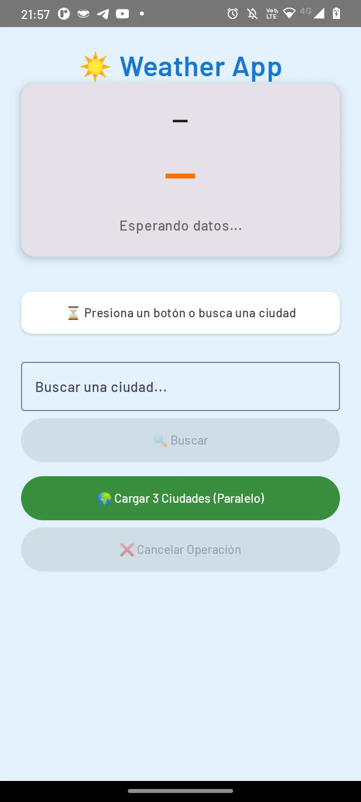
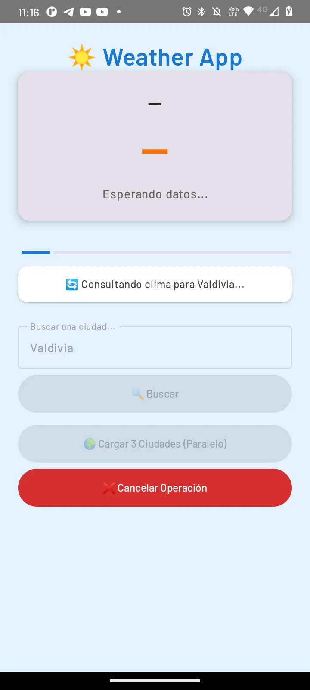
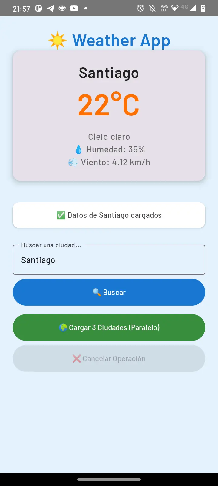
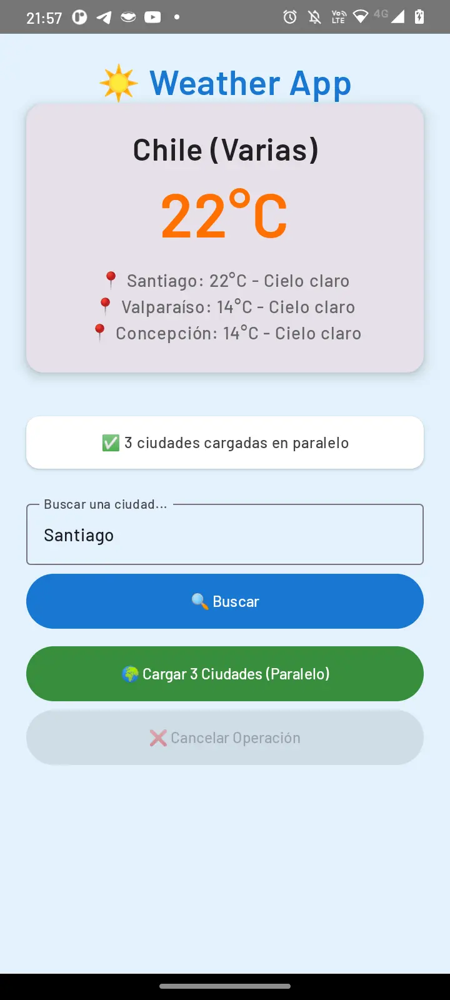
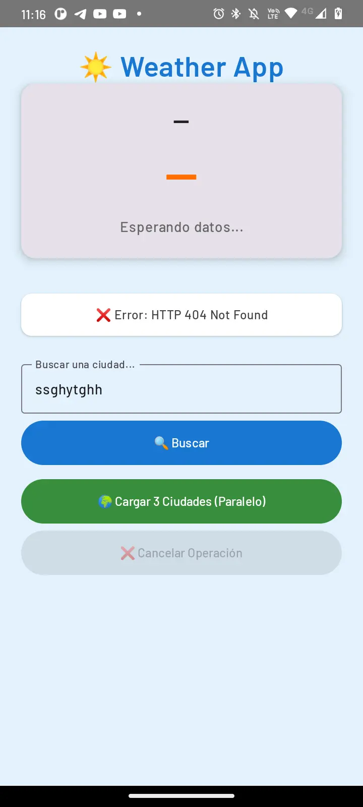
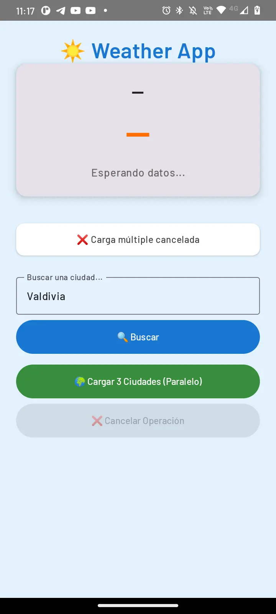

# ☀️ Weather App - Programación Asíncrona en Android

<div align="center">


Aplicación móvil para consultar el clima en distintas ciudades utilizando Kotlin Coroutines, desarrollada con arquitectura MVVM y Jetpack Compose.

</div>

## 📱 Descripción del Proyecto

<p align="center">
  
</p>

Esta aplicación Android demuestra la implementación de programación asíncrona moderna utilizando **Kotlin Coroutines**, respetando las mejores prácticas de desarrollo Android y evitando el bloqueo del hilo principal (UI Thread).

La app consulta datos meteorológicos en tiempo real desde la API de OpenWeatherMap, permitiendo buscar información de ciudades individuales o múltiples ciudades en paralelo.

---

## 🎯 Objetivos del Proyecto

Desarrollar una solución asíncrona eficiente que:
- ✅ Consulte datos de una API REST de clima
- ✅ Utilice Kotlin Coroutines para manejo de concurrencia
- ✅ Maneje correctamente Main Thread y Background Thread
- ✅ Demuestre el uso de `launch`, `async`, `await` y `withContext`
- ✅ Implemente cancelación de operaciones con Job
- ✅ Refleje visualmente el estado de carga con indicadores de progreso

---

## 📚 Análisis Teórico

### 1. ¿Qué son los Threads?

Un **thread** (hilo) es la unidad más pequeña de procesamiento que puede ser ejecutada por un sistema operativo. En Android, cada aplicación tiene un hilo principal llamado **Main Thread** o **UI Thread**, responsable de:
- Renderizar la interfaz de usuario
- Responder a eventos del usuario (clicks, gestos)
- Actualizar componentes visuales

**Problema**: Si realizamos operaciones pesadas (llamadas de red, lectura de base de datos) en el Main Thread, la aplicación se congela y puede generar un ANR (Application Not Responding).

---

### 2. Métodos Tradicionales de Programación Asíncrona

#### **AsyncTask** (Deprecado desde Android 11)
```kotlin
class WeatherTask : AsyncTask<String, Void, WeatherData>() {
    override fun doInBackground(vararg params: String?): WeatherData {
        // Operación en background thread
    }
    
    override fun onPostExecute(result: WeatherData?) {
        // Actualizar UI en Main Thread
    }
}
```

**Problemas de AsyncTask:**
- ❌ Difícil manejo de errores
- ❌ Propenso a memory leaks
- ❌ No respeta el ciclo de vida de Activities/Fragments
- ❌ Código verboso y difícil de mantener

#### **Services**
Los Services se ejecutan en background para tareas de larga duración, pero:
- ❌ Consumen recursos incluso cuando no son necesarios
- ❌ Complejidad en la comunicación con la UI
- ❌ No son ideales para operaciones puntuales como llamadas HTTP

#### **Threads Manuales**
```kotlin
Thread {
    // Operación pesada
    runOnUiThread {
        // Actualizar UI
    }
}.start()
```

**Problemas:**
- ❌ Difícil sincronización
- ❌ Propensión a errores de concurrencia
- ❌ No se cancelan automáticamente

---

### 3. ¿Por qué Kotlin Coroutines es la Solución Recomendada?

**Kotlin Coroutines** es la forma moderna y oficial de Google para manejar asincronía en Android.

#### **Ventajas principales:**

✅ **Código más legible y mantenible**
```kotlin
suspend fun fetchWeather(): WeatherData {
    return withContext(Dispatchers.IO) {
        apiService.getWeather()
    }
}
```

✅ **Manejo automático del ciclo de vida**
- `viewModelScope`: Se cancela automáticamente cuando el ViewModel se destruye
- `lifecycleScope`: Vinculado al ciclo de vida de Activity/Fragment

✅ **Cambio de contexto simple**
```kotlin
viewModelScope.launch {
    val data = withContext(Dispatchers.IO) { 
        // Se ejecuta en hilo de IO
        repository.fetchData() 
    }
    // Automáticamente vuelve al Main Thread
    updateUI(data)
}
```

✅ **Manejo estructurado de errores**
```kotlin
try {
    val result = apiCall()
} catch (e: CancellationException) {
    // Operación cancelada
} catch (e: Exception) {
    // Error de red o servidor
}
```
Nota sobre CancellationException: Esta excepción se maneja de forma especial en coroutines. Aunque actualizamos la UI con un mensaje, re-lanzamos la excepción para que la coroutine se cancele correctamente en toda la jerarquía.


✅ **Concurrencia eficiente con async/await**
```kotlin
val city1 = async { fetchCity("Santiago") }
val city2 = async { fetchCity("Valparaíso") }
// Se ejecutan en paralelo
val results = listOf(city1.await(), city2.await())
```

✅ **Cancelación cooperativa**
- Las coroutines pueden ser canceladas en cualquier momento
- No desperdician recursos

---

## 🏗️ Arquitectura del Proyecto

```
app/
├── data/
│   ├── WeatherData.kt              # Modelo de datos
│   ├── remote/
│   │   ├── WeatherApiService.kt    # Interface Retrofit
│   │   └── WeatherApiResponse.kt   # DTOs de la API
│   └── repository/
│       └── WeatherRepository.kt    # Capa de acceso a datos
├── viewmodel/
│   └── WeatherViewModel.kt         # Lógica de negocio + Coroutines
├── view/
│   ├── WeatherScreen.kt            # Pantalla principal (Compose)
│   └── components/
│       ├── WeatherCard.kt          # Card de clima
│       └── StatusCard.kt           # Indicador de estado
└── ui/theme/                       # Configuración de tema
```

### Patrón de Arquitectura: MVVM

- **Model**: `WeatherData`, `WeatherRepository`
- **View**: `WeatherScreen` (Jetpack Compose)
- **ViewModel**: `WeatherViewModel` (gestiona estado y coroutines)

---

## 🔧 Implementación de Conceptos Clave

### 1. **`launch`**: Iniciar una Coroutine

```kotlin
fun loadWeatherForCity(cityName: String) {
    weatherJob = viewModelScope.launch {
        _uiState.value = WeatherUiState(isLoading = true)
        val data = withContext(Dispatchers.IO) {
            repository.fetchCityWeather(cityName)
        }
        _uiState.value = WeatherUiState(weatherData = data)
    }
}
```

**¿Qué hace?**
- Inicia una coroutine en el `viewModelScope`
- No bloquea el hilo actual
- Retorna un `Job` que puede ser cancelado

---

### 2. **`async` y `await`**: Ejecución Paralela

```kotlin
fun loadMultipleWeather() {
    viewModelScope.launch {
        val santiago = async(Dispatchers.IO) { 
            repository.fetchCityWeather("Santiago") 
        }
        val valparaiso = async(Dispatchers.IO) { 
            repository.fetchCityWeather("Valparaíso") 
        }
        val concepcion = async(Dispatchers.IO) { 
            repository.fetchCityWeather("Concepción") 
        }
        
        val cities = listOf(
            santiago.await(), 
            valparaiso.await(), 
            concepcion.await()
        )
        _uiState.value = WeatherUiState(weatherDataList = cities)
    }
}
```

**¿Por qué es eficiente?**
- Las 3 llamadas HTTP se ejecutan **simultáneamente**
- `await()` espera el resultado sin bloquear
- Reduce el tiempo total de espera (de 6 segundos secuencial a ~2 segundos paralelo)

---

### 3. **`withContext`**: Cambio de Dispatcher

```kotlin
val data = withContext(Dispatchers.IO) {
    apiService.getWeather() // Se ejecuta en hilo de IO
}
// Automáticamente continúa en Main Thread
updateUI(data)
```

**Dispatchers disponibles:**
- `Dispatchers.Main`: UI Thread (actualizar vistas)
- `Dispatchers.IO`: Operaciones de entrada/salida (red, archivos)
- `Dispatchers.Default`: Operaciones CPU-intensivas

---

### 4. **Job y Cancelación**

```kotlin
private var weatherJob: Job? = null

fun cancelJob() {
    weatherJob?.cancel()
}
```

**Ventajas:**
- Evita que operaciones obsoletas consuman recursos
- Previene actualizaciones de UI con datos desactualizados
- El `viewModelScope` cancela automáticamente todas las coroutines al destruirse

---

## 🚀 Prevención de Bloqueo de la Interfaz

### Estrategias Implementadas:

#### 1. **Separación de Hilos**
```kotlin
withContext(Dispatchers.IO) {
    // Operación de red - NO BLOQUEA UI
    repository.fetchCityWeather(cityName)
}
```
Las llamadas HTTP se ejecutan en un pool de hilos optimizado para I/O.

#### 2. **StateFlow para UI Reactiva**
```kotlin
val uiState: StateFlow<WeatherUiState> = _uiState.asStateFlow()
```
La UI se actualiza automáticamente cuando cambia el estado, sin bloqueos.

#### 3. **Indicadores Visuales**
```kotlin
if (uiState.isLoading) {
    LinearProgressIndicator(modifier = Modifier.fillMaxWidth())
}
```
El usuario siempre ve feedback visual durante operaciones asíncronas.

#### 4. **Manejo de Errores Robusto**
```kotlin
try {
    val data = withContext(Dispatchers.IO) { ... }
} catch (e: CancellationException) {
    // Usuario canceló - no es un error
} catch (e: Exception) {
    // Error de red o servidor
    _uiState.value = uiState.copy(statusMessage = "Error: ${e.message}")
}
```

---

## 📸 Capturas de Pantalla

Todas las capturas se encuentran en la carpeta `/assets`:

1. **Estado Inicial** - Interfaz lista para búsqueda
2. **Cargando Datos** - ProgressBar visible durante consulta
3. **Datos Cargados** - Información meteorológica de una ciudad
4. **Búsqueda Múltiple** - Tres ciudades cargadas en paralelo
5. **Manejo de Errores** - Ciudad no encontrada
6. **Cancelación** - Job cancelado por el usuario

| Estado Inicial | Cargando Datos | Datos Cargados | Búsqueda Múltiple | Manejo de Errores | Cancelación |
| :----------------: | :---------------: | :------------: | :------------: | :------------: | :------------: |
|  |  |  |  |  |  |

---

## 🛠️ Tecnologías Utilizadas

- **Lenguaje**: Kotlin
- **UI**: Jetpack Compose
- **Arquitectura**: MVVM
- **Asincronía**: Kotlin Coroutines + Flow
- **Networking**: Retrofit + Gson
- **API**: OpenWeatherMap API

---

## ⚙️ Configuración del Proyecto

### Requisitos:
- Android Studio Hedgehog o superior
- SDK mínimo: API 24 (Android 7.0)
- API Key de OpenWeatherMap

### Pasos:
1. Clonar el repositorio
2. Agregar tu API Key en `local.properties`:
   ```properties
   API_WEATHER=tu_api_key_aqui
   ```
3. Sincronizar Gradle
4. Ejecutar en emulador o dispositivo físico

---

## 🎓 Conceptos Demostrados

| Concepto | Ubicación en el Código | Línea |
|----------|------------------------|-------|
| `launch` | `WeatherViewModel.kt` | 52, 72 |
| `async` | `WeatherViewModel.kt` | 76-78 |
| `await` | `WeatherViewModel.kt` | 81 |
| `withContext` | `WeatherViewModel.kt` | 56 |
| Job + Cancelación | `WeatherViewModel.kt` | 48, 95-97 |
| StateFlow | `WeatherViewModel.kt` | 43-44 |
| suspend function | `WeatherRepository.kt` | 34, 42, 47 |

---

## ✅ Conclusión

Este proyecto demuestra que **Kotlin Coroutines** es la solución más eficiente, segura y legible para programación asíncrona en Android moderno. 

La arquitectura implementada garantiza:
- ✅ UI fluida sin bloqueos
- ✅ Código fácil de mantener
- ✅ Manejo adecuado del ciclo de vida
- ✅ Cancelación eficiente de operaciones
- ✅ Concurrencia optimizada

---

## 📄 Licencia

Este proyecto es material académico para fines educativos.
**Desarrollado como parte de la Actividad AE4 - ABP1** 

---

## 👨‍💻 Autor


**[Yerko Osorio]**

- GitHub: [@yerkoppp](https://github.com/yerkoppp)

---

## 🙏 Agradecimientos

- Documentación oficial de [Android Developers](https://developer.android.com/)
- Comunidad de [Kotlin](https://kotlinlang.org/)
- Guías de [Jetpack Compose](https://developer.android.com/jetpack/compose)

---

<div align="center">

**⭐ Si te gustó este proyecto, considera darle una estrella ⭐**

Hecho con ❤️ y Kotlin

</div>